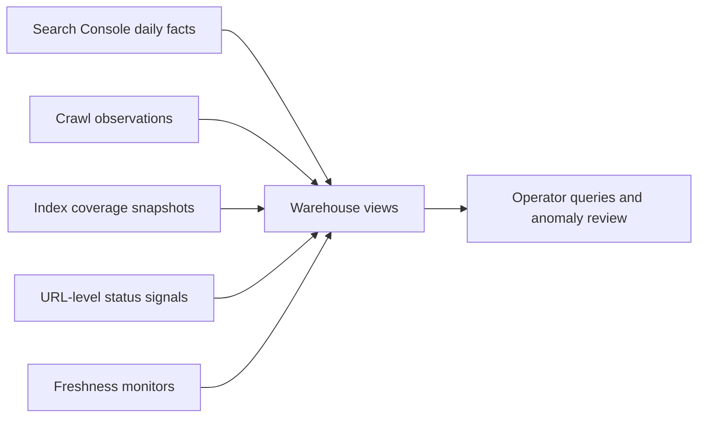
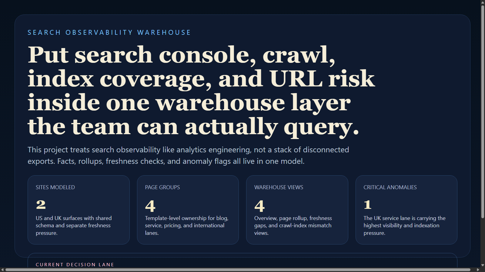
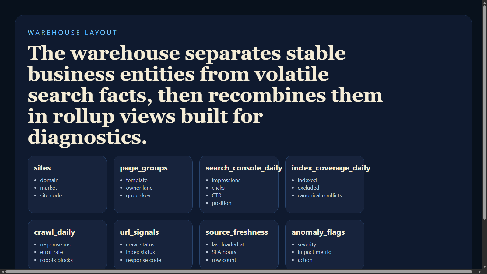
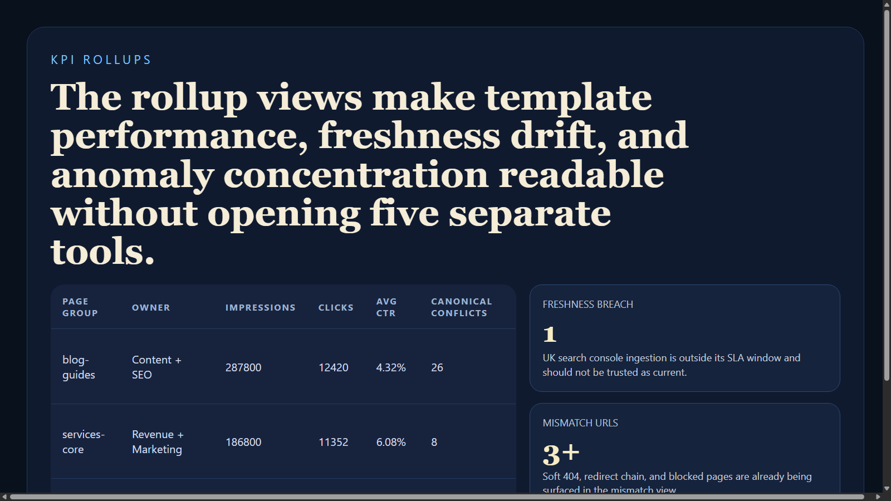
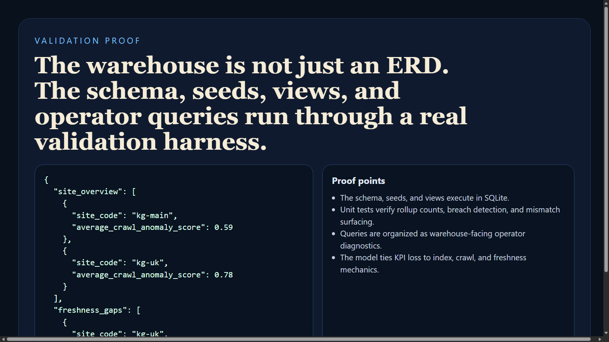

# Search Observability Warehouse

Search Observability Warehouse is a warehouse-first project for modeling search console, crawl, index coverage, and URL health signals in one analytics layer. Instead of keeping search performance and crawl risk in separate reports, the project organizes them into shared fact tables, rollup views, and operator-friendly queries.

## Executive Summary

This repo shows how search observability can be treated like a real analytics engineering problem. It models site performance, crawl behavior, index coverage, URL status, freshness drift, and anomaly flags in a single warehouse shape that supports diagnostics instead of isolated reporting.

## Portfolio Takeaway

- explicit SQL and warehouse modeling signal
- search console, crawl, and indexation facts under one schema
- rollup views for page-group and site-level diagnostics
- validation harness proving the schema, seed data, and views execute cleanly

## Overview

| Area | Details |
| --- | --- |
| Warehouse dialect | SQLite-compatible ANSI SQL |
| Validation harness | Python 3 standard library |
| Core layers | schema, seeds, views, operator queries |
| Core domains | sites, page groups, crawl facts, search facts, index coverage, anomaly flags |
| Outputs | SQL rollups, JSON proof, screenshot pack |

## Warehouse Structure

- `sql/schema.sql`
- `sql/seed.sql`
- `sql/views.sql`
- `sql/queries.sql`
- `docs/erd.mmd`

## Core Tables

- `sites`
- `page_groups`
- `source_freshness`
- `crawl_daily`
- `search_console_daily`
- `index_coverage_daily`
- `url_signals`
- `anomaly_flags`

## Request Flow



## Example Questions This Warehouse Answers

- Which page groups are losing CTR without losing impressions?
- Which templates are showing crawl and index mismatches?
- Which sites are falling behind freshness SLAs?
- Which anomaly flags are concentrated in the same business owner lane?

## Validation Output

The included validation harness loads the warehouse into SQLite, executes the schema, seeds, and views, then prints proof queries for:

- site overview
- freshness lag
- crawl vs. index mismatch
- page-group performance
- active anomalies

## Screenshots

### Warehouse Control View


### ERD and Fact Layout


### KPI Rollups


### Validation Proof


## Run Locally

```powershell
Set-Location "C:\Users\chaus\dev\repos\search-observability-warehouse"
python .\scripts\run_demo.py
python -m unittest discover -s tests
```

## Validation

```powershell
Set-Location "C:\Users\chaus\dev\repos\search-observability-warehouse"
python .\scripts\run_demo.py
python -m unittest discover -s tests
```

## Tech Stack

[](https://sqlite.org/lang.html)
[](https://www.python.org/)
[](https://mermaid.js.org/)

## Portfolio Links

- [Kinetic Gain](https://kineticgain.com/)
- [LinkedIn](https://www.linkedin.com/in/mirzacausevic)
- [Skills Page](https://mizcausevic.com/skills/)
- [Medium](https://medium.com/@mizcausevic)
- [GitHub](https://github.com/mizcausevic-dev)
