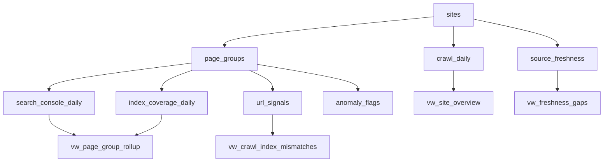

# Architecture

Search Observability Warehouse combines site-level, page-group, crawl, and indexation signals into a single analytical model.

## Model Flow

## Warehouse Intent

The schema keeps search reporting grounded in operational diagnostics:

- `sites` anchors domain-level performance
- `page_groups` maps templates and business ownership
- `search_console_daily` captures demand and engagement
- `index_coverage_daily` captures discoverability and exclusions
- `url_signals` captures crawl status, response codes, and canonical problems
- `source_freshness` surfaces stale ingestion risk
- `anomaly_flags` turns observations into action

## Why This Shape Works

It makes it possible to ask warehouse-native questions that connect reporting to operational decision-making. Search losses can be traced back to crawl failures, exclusions, or stale data instead of just being noted as KPI regressions.
